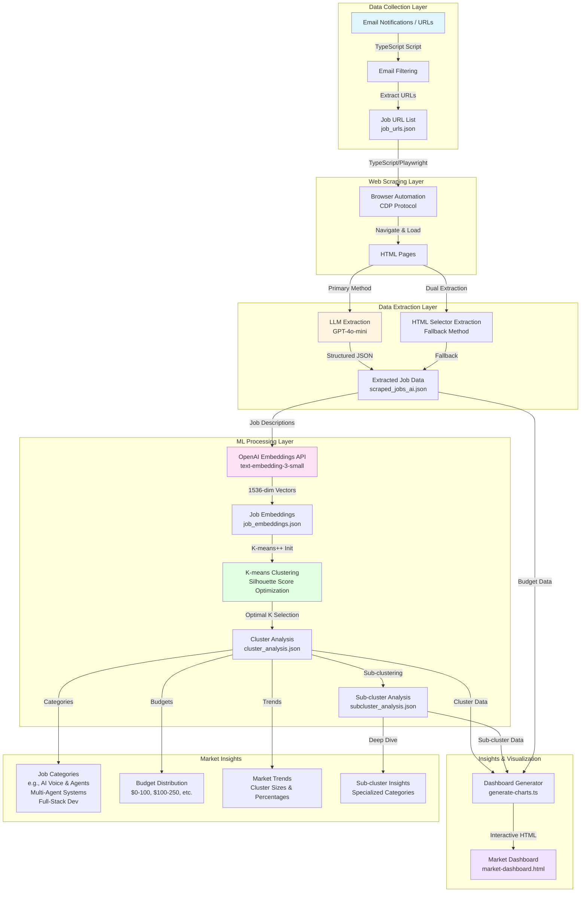

# AI/ML Pipeline Architecture

## System Overview

This document describes the end-to-end AI/ML pipeline for extracting structured data from web sources, generating semantic embeddings, and performing clustering analysis.

## Architecture Diagram



## Component Details

### 1. Data Collection Layer
- **Input**: Email notifications (emails.json) or direct URL list
- **Process**: TypeScript scripts filter emails and extract job URLs using configurable regex patterns
- **Output**: List of unique job URLs (job_urls.json)

### 2. Web Scraping Layer
- **Technology**: TypeScript with Playwright (CDP-based browser automation)
- **Features**: 
  - Cloudflare bypass
  - Session management
  - Screenshot capture
  - Content expansion (handles "View More" buttons)

### 3. Data Extraction Layer
- **Primary Method**: LLM Extraction (GPT-4o-mini)
  - Extracts: jobTitle, budget, postedTime, description
  - Processes HTML directly (up to 30K chars)
  - Returns structured JSON
- **Fallback Method**: HTML Selector Extraction
  - Uses CSS selectors as backup
  - Handles cases where LLM extraction fails

### 4. ML Processing Layer

#### Embedding Generation
- **Model**: OpenAI `text-embedding-3-small`
- **Dimensions**: 1536-dimensional vectors
- **Input**: Job descriptions (truncated to ~8K chars)
- **Output**: Semantic embeddings capturing job semantics

#### Clustering Algorithm
- **Algorithm**: K-means clustering with K-means++ initialization
- **Optimization**: Silhouette score to find optimal K
- **Process**:
  1. Test K values from minK to maxK (typically 3-7)
  2. Calculate silhouette score for each K
  3. Select K with highest silhouette score
  4. Perform final clustering with optimal K
- **Output**: 
  - Cluster assignments
  - Cluster centroids
  - Representative jobs per cluster
  - Cluster summaries (via LLM)

#### Sub-clustering
- **Purpose**: Deeper analysis of specific clusters (e.g., AI/ML jobs)
- **Process**: Re-cluster selected clusters for granular insights
- **Output**: Sub-cluster analysis with specialized categories

### 5. Insights & Visualization

#### Dashboard Generation
- **Technology**: TypeScript with Chart.js and D3.js
- **Visualizations**:
  - Pie/Donut Chart: Job category distribution
  - Bar Chart: Cluster size comparison
  - Treemap: Hierarchical cluster → sub-cluster view
  - Budget Distribution: Budget range analysis
- **Features**:
  - Interactive tooltips
  - Responsive design
  - Dark theme UI

## Data Flow

```
Email Notifications / URLs
    ↓
Email Filtering (TypeScript)
    ↓
URL Extraction (TypeScript)
    ↓
Web Scraping (TypeScript/Playwright)
    ↓
LLM Extraction (GPT-4o-mini)
    ↓
Structured Job Data (JSON)
    ↓
Embedding Generation (OpenAI)
    ↓
Semantic Vectors (1536-dim)
    ↓
K-means Clustering (ml-kmeans)
    ↓
Cluster Analysis (JSON)
    ↓
Sub-clustering (Optional)
    ↓
Dashboard Generation
    ↓
Interactive Visualization
```

## Key Technologies

- **TypeScript/Node.js**: Complete pipeline (email processing, web scraping, ML analysis, visualization)
- **Playwright**: Browser automation, CDP protocol
- **OpenAI API**: 
  - GPT-4o-mini (data extraction)
  - text-embedding-3-small (embeddings)
- **ML Libraries**: 
  - ml-kmeans (clustering)
  - Custom silhouette score calculation
- **Visualization**: 
  - Chart.js (charts)
  - D3.js (treemap)

## Output Files

- `data/raw/job_urls.json` - Extracted job URLs
- `data/processed/scraped_jobs_ai.json` - Structured job data
- `data/processed/job_embeddings.json` - Semantic embeddings
- `data/processed/cluster_analysis.json` - Main cluster analysis
- `data/processed/subcluster_analysis.json` - Sub-cluster analysis
- `llm-etl-analysis/market-dashboard.html` - Interactive dashboard

## Market Insights Generated

1. **Job Categories**: Automated categorization (e.g., "AI Voice & Agents", "Multi-Agent Systems", "Full-Stack Development")
2. **Budget Analysis**: Distribution across price ranges
3. **Market Trends**: Cluster sizes reveal popular job types
4. **Specialized Insights**: Sub-clusters identify niche markets

